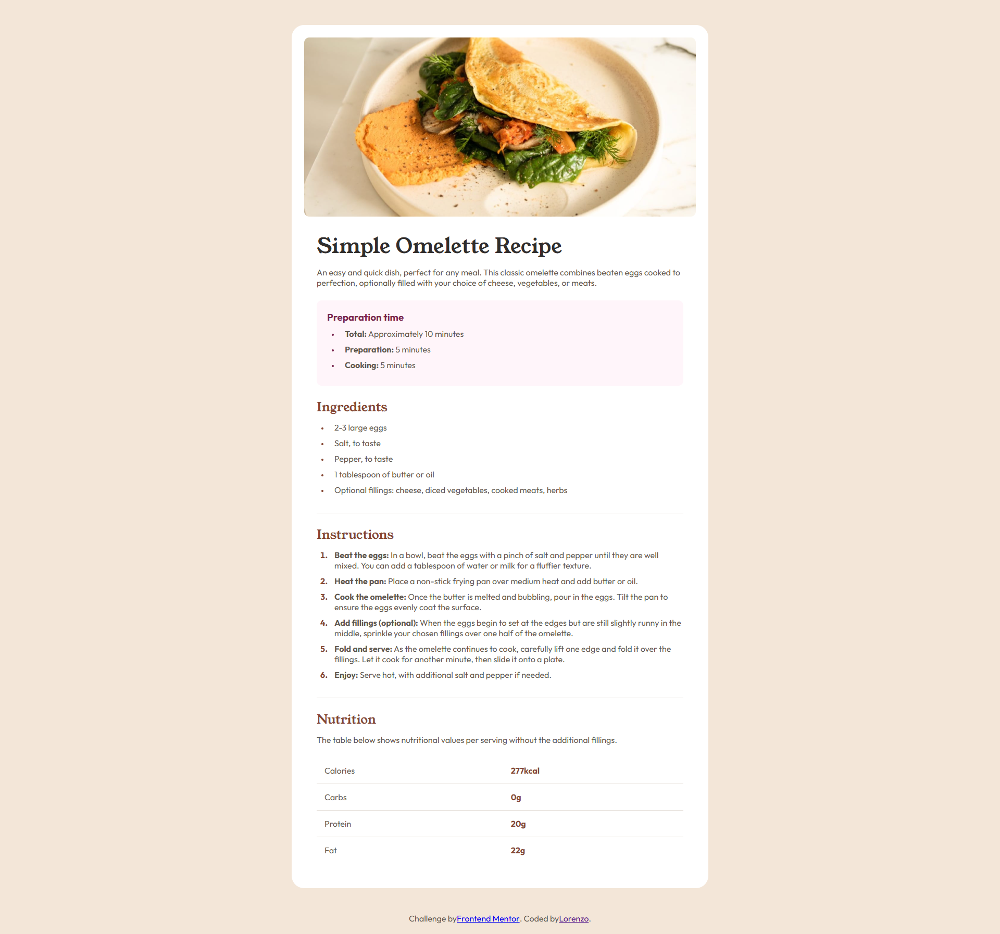

# Frontend Mentor - Recipe page solution

This is a solution to the [Recipe page challenge on Frontend Mentor](https://www.frontendmentor.io/challenges/recipe-page-KiTsR8QQKm). Frontend Mentor challenges help you improve your coding skills by building realistic projects. 

## Table of contents

- [Overview](#overview)
  - [Screenshot](#screenshot)
  - [Links](#links)
- [My process](#my-process)
  - [Technologies Used](#technologies-Used)
  - [What I learned](#what-i-learned)
- [Author](#author)

## Overview

### Screenshot

### Links

- Solution URL: [Solution here](https://www.frontendmentor.io/solutions/recipe-page-iEJEnvS277)
- Live Site URL: [Recipe Page](https://lorenzopvoid.github.io/recipe-page-main/)

## My process

### 🛠️ Technologies Used

- Semantic HTML5 markup
- CSS custom properties
- Media Queries for responsiveness

### What I learned

This is a responsive recipe page project that displays a simple omelette recipe. The page includes details such as preparation time, ingredients, instructions, and a nutrition table, all styled with a clean and mobile-friendly design.

## Author

- Github - [Lorenzo Eduardo Paulino](https://github.com/lorenzopVoid)
- Frontend Mentor - [@lorenzopVoid](https://www.frontendmentor.io/profile/lorenzopVoid)
- LinkedIn - [Lorenzo Eduardo Paulino de Oliveira](https://www.linkedin.com/in/lorenzopaulino/)

